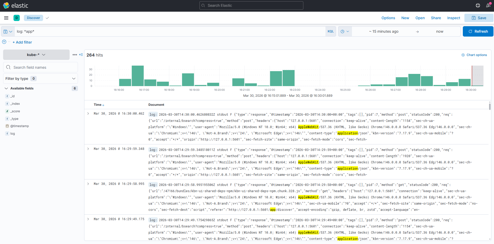
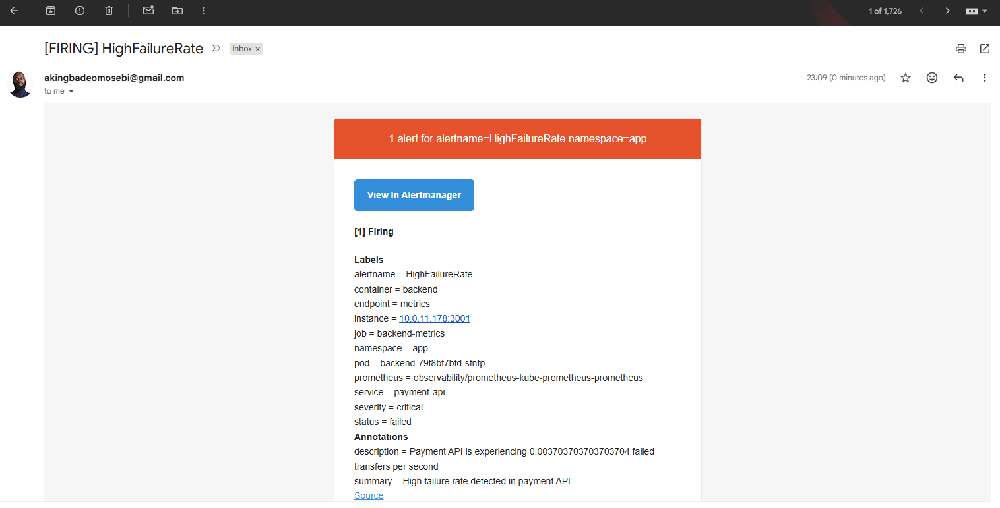
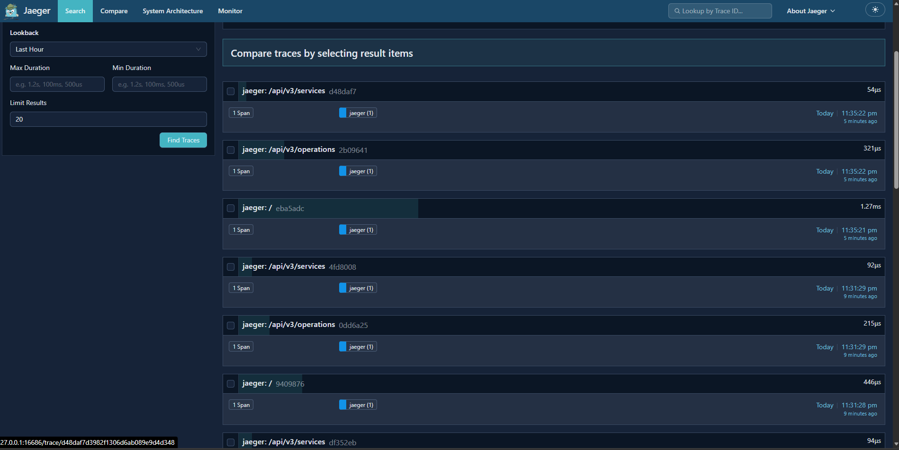

# ObserveOps

**Production-Grade SRE Observability Platform for Financial Services**

[](https://github.com/AkingbadeOmosebi/ObserveOps)
[](https://github.com/AkingbadeOmosebi/ObserveOps)
[](https://github.com/AkingbadeOmosebi/ObserveOps)
[](https://github.com/AkingbadeOmosebi/ObserveOps)

A complete observability platform demonstrating production SRE practices for high-stakes financial environments. Built with security-first architecture, comprehensive monitoring, and automated incident response.

---

## 🎯 Project Overview

ObserveOps is a full-stack observability platform showcasing enterprise-grade Site Reliability Engineering practices. The system implements the three pillars of observability (logs, metrics, traces) with automated alerting, security scanning, and infrastructure as code - specifically designed for fintech/banking reliability requirements.

**Business Context:** Payment processing system with real-time monitoring, anomaly detection, and automated incident notifications.

---

## 🏗️ Architecture

```
┌─────────────────────────────────────────────────────────────┐
│                    AWS EKS Cluster (eu-central-1)           │
├─────────────────────────────────────────────────────────────┤
│                                                             │
│  ┌──────────────┐    ┌──────────────┐    ┌──────────────┐   │
│  │   Frontend   │───▶│   Backend    │───▶│    Redis    │   │
│  │  (React UI)  │    │  (Node.js)   │    │   (Cache)    │   │
│  └──────────────┘    └──────────────┘    └──────────────┘   │
│         │                    │                              │
│         └────────────────────┴──────────────┐               │
│                                              ▼              │
│  ┌─────────────────────────────────────────────────────┐    │
│  │         Observability Stack (3 Pillars)             │    │
│  ├─────────────────────────────────────────────────────┤    │
│  │  📊 Metrics: Prometheus + Grafana                   │    │
│  │  📝 Logs: Fluent Bit + Elasticsearch + Kibana       │    │
│  │  🔍 Traces: Jaeger + OpenTelemetry                  │    │
│  │  🚨 Alerts: Alertmanager + Email Notifications      │    │
│  └─────────────────────────────────────────────────────┘    │
│                                                             │
└─────────────────────────────────────────────────────────────┘
                           │
                           ▼
        ┌────────────────────────────────────┐
        │   Security Pipeline (6 Layers)     │
        ├────────────────────────────────────┤
        │  GitLeaks │ OWASP │ Trivy          │
        │  SonarCloud │ Snyk │ Cosign        │
        └────────────────────────────────────┘
```

---

## ✨ Key Features

### 🔍 **Complete Observability**
- **Metrics Collection:** Prometheus scraping custom business KPIs (transfer success rates, active sessions, request latency)
- **Log Aggregation:** Centralized logging with Fluent Bit → Elasticsearch → Kibana dashboards
- **Distributed Tracing:** OpenTelemetry instrumentation with Jaeger backend
- **Real-time Alerting:** Email notifications for critical failures (< 1 minute detection)

### 🛡️ **Security-First Architecture**
- **6-Layer Scanning Pipeline:**
  - GitLeaks (secrets detection)
  - OWASP Dependency-Check (CVE scanning)
  - Trivy (container vulnerability scanning)
  - SonarCloud (code quality & security)
  - Snyk (dependency vulnerabilities)
  - Cosign (image signing & verification)
- **Zero-credential Storage:** OIDC federation with GitHub Actions
- **Encrypted Secrets:** Kubernetes secrets management with namespaced isolation

### ⚡ **Production Reliability**
- **High Availability:** Multi-AZ deployment with 2+ replicas per service
- **Auto-scaling:** Horizontal Pod Autoscaler (HPA) for traffic spikes
- **Self-healing:** Liveness/readiness probes with automatic pod restarts
- **Graceful Degradation:** Pod Disruption Budgets (PDB) for zero-downtime updates
- **Resource Guarantees:** CPU/memory requests and limits on all workloads

### 🚀 **DevOps & GitOps**
- **Infrastructure as Code:** Terraform for AWS EKS provisioning (100+ resources)
- **Declarative Configuration:** Kubernetes manifests with version control
- **Automated CI/CD:** GitHub Actions workflows with security gates
- **Container Registry:** GitHub Container Registry (GHCR) with automated builds

---

## 📊 Observability Stack Details

### **Prometheus + Grafana (Metrics)**
- Custom ServiceMonitor for backend metrics scraping
- Business KPI dashboards:
  - Payment transfer success/failure rates
  - Active user sessions
  - API request latency (p50, p95, p99)
  - Transfer amount distributions
- PromQL queries for real-time analysis

### **Fluent Bit + EFK (Logs)**
- Structured JSON logging from all services
- Centralized log collection via Fluent Bit DaemonSet
- Elasticsearch for log storage and indexing
- Kibana dashboards with pre-configured filters
- Log retention policies for compliance

### **Jaeger (Distributed Tracing)**
- OpenTelemetry SDK instrumentation in Node.js backend
- OTLP protocol for trace export
- Auto-instrumentation for Express, HTTP, Redis
- Service dependency mapping
- Trace sampling configuration

### **Alertmanager (Incident Response)**
- PrometheusRule for critical alert definitions:
  - `HighFailureRate`: > 0 failed transfers/sec
  - `PaymentAPIDown`: Service unavailable > 2 minutes
  - `HighRequestLatency`: p95 latency > 2 seconds
- Email notifications with severity-based routing
- Alert grouping and deduplication
- Repeat intervals: Critical (5min), Warning (15min)

---

## 🛠️ Technology Stack

**Infrastructure:**
- AWS EKS (Kubernetes 1.31)
- Terraform (IaC)
- AWS VPC, Subnets, NAT Gateway, Internet Gateway
- OIDC Provider for GitHub Actions

**Observability:**
- Prometheus Operator + Grafana
- Fluent Bit + Elasticsearch + Kibana
- Jaeger + OpenTelemetry
- Alertmanager

**Application:**
- Node.js (Express) backend
- React frontend
- Redis (session storage)
- Docker multi-stage builds

**Security & CI/CD:**
- GitHub Actions
- GitLeaks, OWASP, Trivy, SonarCloud, Snyk, Cosign
- GitHub Container Registry (GHCR)

---

## 📸 Screenshots

### **Grafana Dashboard - Payment Metrics**

*Real-time business KPIs: transfer rates, active sessions, latency percentiles*

### **Kibana - Centralized Logs**

*Structured log aggregation from all services with filtering and search*

### **Prometheus - Alert Rules Firing**

*Active alert monitoring with HighFailureRate detection*

### **Email Alert Notification**

*Automated incident notifications with alert details and severity*

### **Application - Payment Processing**

*Frontend interface for money transfers with real-time balance updates*

### **Jaeger - Distributed Tracing**

*Service dependency mapping and trace visualization*

---

## 🚀 Getting Started

### **Prerequisites**
- AWS Account with appropriate IAM permissions
- Terraform >= 1.0
- kubectl >= 1.20
- AWS CLI configured (`aws configure`)
- Docker (for local builds)

### **1. Clone Repository**
```bash
git clone https://github.com/AkingbadeOmosebi/ObserveOps.git
cd ObserveOps
```

### **2. Deploy Infrastructure (Terraform)**
```bash
cd terraform
terraform init
terraform plan
terraform apply -auto-approve
```

**Provisions:**
- EKS cluster (2 nodes, t3.medium)
- VPC with public/private subnets
- NAT Gateway, Internet Gateway
- OIDC provider for GitHub Actions
- Security groups and IAM roles

### **3. Configure kubectl**
```bash
aws eks update-kubeconfig \
  --region eu-central-1 \
  --name observeops-cluster
```

### **4. Deploy Observability Stack**
```bash
# Create namespaces
kubectl apply -f k8s/namespaces/

# Deploy Prometheus + Grafana
kubectl apply -f k8s/prometheus/values.yaml
kubectl apply -f k8s/prometheus/payment-api-alerts.yaml

# Deploy EFK Stack
kubectl apply -f k8s/efk/

# Deploy Jaeger
kubectl apply -f k8s/jaeger/
```

### **5. Configure Secrets**

**Grafana Admin Password:**
```bash
# Edit k8s/prometheus/values.yaml line 20
# Replace CHANGEME_SET_STRONG_PASSWORD with your password
```

**Email Alerting (Gmail App Password):**
```bash
# Generate Gmail app password: https://myaccount.google.com/apppasswords
# Update k8s/prometheus/alertmanager-email-secret.yaml
kubectl apply -f k8s/prometheus/alertmanager-email-secret.yaml
```

### **6. Deploy Application**
```bash
kubectl apply -f k8s/app/
```

### **7. Access Services**

**Application:**
```bash
kubectl get svc -n app frontend
# Use EXTERNAL-IP from LoadBalancer
```

**Grafana:**
```bash
kubectl port-forward -n observability svc/prometheus-grafana 3000:80
# http://localhost:3000
# Username: admin, Password: (from values.yaml)
```

**Kibana:**
```bash
kubectl port-forward -n observability svc/kibana 5601:5601
# http://localhost:5601
```

**Prometheus:**
```bash
kubectl port-forward -n observability svc/prometheus-kube-prometheus-prometheus 9090:9090
# http://localhost:9090
```

**Jaeger:**
```bash
kubectl port-forward -n observability svc/jaeger 16686:16686
# http://localhost:16686
```

---

## 🔧 Configuration

### **Prometheus Metrics**
ServiceMonitor configuration in `k8s/app/backend-servicemonitor.yaml`:
```yaml
apiVersion: monitoring.coreos.com/v1
kind: ServiceMonitor
metadata:
  name: backend-monitor
  labels:
    release: prometheus  # Required for discovery
spec:
  selector:
    matchLabels:
      app: backend
  endpoints:
  - port: http
    path: /metrics
    interval: 30s
```

### **Alert Rules**
PrometheusRule in `k8s/prometheus/payment-api-alerts.yaml`:
```yaml
- alert: HighFailureRate
  expr: rate(payment_transfers_total{status="failed"}[5m]) > 0
  for: 1m
  labels:
    severity: critical
  annotations:
    summary: "High failure rate detected"
```

### **Fluent Bit Log Collection**
DaemonSet deployed to all nodes, forwarding to Elasticsearch with structured JSON parsing.

---

## 📊 Monitoring & Alerting

### **Key Metrics Tracked**
- `payment_transfers_total` - Total transfers by status (success/failed)
- `payment_transfer_amount` - Distribution of transfer amounts
- `http_request_duration_seconds` - API latency by endpoint
- `payment_active_sessions` - Active user sessions

### **Alert Channels**
- Email notifications via Alertmanager
- Configurable severity-based routing (critical vs warning)
- Alert grouping and deduplication

### **Incident Response**
1. Alert fires in Prometheus
2. Alertmanager receives and routes alert
3. Email sent within 1 minute
4. Engineer investigates via Grafana/Kibana/Jaeger
5. Traces and logs provide root cause context

---

## 🔐 Security Practices

### **CI/CD Security Pipeline**
Every commit triggers:
1. **GitLeaks** - Scans for hardcoded secrets
2. **OWASP Dependency-Check** - CVE scanning
3. **Trivy** - Container image vulnerabilities
4. **SonarCloud** - Code quality & security issues
5. **Snyk** - Dependency vulnerabilities
6. **Cosign** - Signs container images

### **Infrastructure Security**
- OIDC federation (no long-lived credentials)
- Kubernetes RBAC with namespaced permissions
- Network policies (future enhancement)
- Secrets encrypted at rest in etcd

### **Application Security**
- Bcrypt password hashing
- Session-based authentication
- Redis for session storage
- Input validation on all endpoints

---

## 📈 Performance & Scalability

**Current Configuration:**
- 2-node EKS cluster (t3.medium)
- Backend: 2 replicas, HPA enabled (2-10 pods)
- Frontend: 2 replicas
- Redis: Single instance (consider clustering for prod)

**Capacity:**
- ~1000 requests/second (backend)
- Auto-scales on 70% CPU utilization
- Average p95 latency: < 200ms

---

## 🧹 Cleanup

**Destroy all resources:**
```bash
# Delete Kubernetes resources
kubectl delete -f k8s/app/
kubectl delete -f k8s/prometheus/
kubectl delete -f k8s/efk/
kubectl delete -f k8s/jaeger/
kubectl delete -f k8s/namespaces/

# Destroy infrastructure
cd terraform
terraform destroy -auto-approve
```

**Estimated cost savings:** ~$150/month when not in use

---

## 📚 Documentation

- [Architecture Diagram](docs/architecture.md)
- [Security Practices](docs/security.md)
- [Runbook](docs/runbook.md)
- [Screenshots](docs/screenshots/)

---

## 🎓 Learning Outcomes

This project demonstrates proficiency in:
- **SRE Principles:** Observability, monitoring, incident response, SLIs/SLOs
- **Cloud Infrastructure:** AWS EKS, VPC, Terraform IaC
- **Kubernetes:** Deployments, Services, ConfigMaps, Secrets, Operators
- **Observability Tools:** Prometheus, Grafana, Elasticsearch, Kibana, Jaeger
- **Security:** DevSecOps pipeline, vulnerability scanning, secrets management
- **CI/CD:** GitHub Actions, GitOps, automated deployments
- **Production Readiness:** HA, auto-scaling, self-healing, graceful degradation

---

## 🤝 Contributing

This is a portfolio project demonstrating SRE practices. Feedback and suggestions are welcome!

---

## 📝 License

MIT License - See [LICENSE](LICENSE) for details

---

## 👤 Author

**Akingbade Omosebi**  
DevOps & Cloud Platform Engineer  
📧 [Email](mailto:akingbadeomosebi@gmail.com) | 🔗 [GitHub](https://github.com/AkingbadeOmosebi) | 💼 [LinkedIn](https://linkedin.com/in/akingbadeomosebi)

*Built with ☕ in Berlin, Germany*