# ObserveOps

**Production-Grade SRE Observability Platform for Financial Services**

[](https://github.com/AkingbadeOmosebi/ObserveOps)
[](https://github.com/AkingbadeOmosebi/ObserveOps)
[](https://github.com/AkingbadeOmosebi/ObserveOps)
[](https://github.com/AkingbadeOmosebi/ObserveOps)

A complete observability platform demonstrating production SRE practices for high-stakes financial environments. Built with security-first architecture, comprehensive monitoring, and automated incident response.

---

## 🎯 Project Overview

ObserveOps is a full-stack observability platform showcasing enterprise-grade Site Reliability Engineering practices. The system implements the three pillars of observability (logs, metrics, traces) with automated alerting, security scanning, and infrastructure as code - specifically designed for fintech/banking reliability requirements.

**Business Context:** Payment processing system with real-time monitoring, anomaly detection, and automated incident notifications.

---

## 🏗️ Architecture

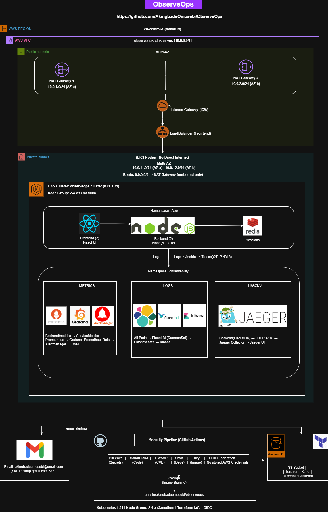

*Production-grade observability platform on AWS EKS with VPC isolation, OIDC federation, and comprehensive monitoring*

---

## ✨ Key Features

### 🔍 Complete Observability
- **Metrics Collection:** Prometheus scraping custom business KPIs (transfer success rates, active sessions, request latency)
- **Log Aggregation:** Centralized logging with Fluent Bit → Elasticsearch → Kibana dashboards
- **Distributed Tracing:** OpenTelemetry instrumentation with Jaeger backend
- **Real-time Alerting:** Email notifications for critical failures (< 1 minute detection)

### 🛡️ Security-First Architecture
- **6-Layer Scanning Pipeline:**
  - GitLeaks (secrets detection)
  - OWASP Dependency-Check (CVE scanning)
  - Trivy (container vulnerability scanning)
  - SonarCloud (code quality & security)
  - Snyk (dependency vulnerabilities)
  - Cosign (image signing & verification)
- **Zero-credential Storage:** OIDC federation with GitHub Actions
- **Encrypted Secrets:** Kubernetes secrets management with namespaced isolation

### ⚡ Production Reliability
- **High Availability:** Multi-AZ deployment with 2+ replicas per service
- **Auto-scaling:** Horizontal Pod Autoscaler (HPA) for traffic spikes
- **Self-healing:** Liveness/readiness probes with automatic pod restarts
- **Graceful Degradation:** Pod Disruption Budgets (PDB) for zero-downtime updates
- **Resource Guarantees:** CPU/memory requests and limits on all workloads

### 🚀 DevOps & GitOps
- **Infrastructure as Code:** Terraform for AWS EKS provisioning (100+ resources)
- **Declarative Configuration:** Kubernetes manifests with version control
- **Automated CI/CD:** GitHub Actions workflows with security gates
- **Container Registry:** GitHub Container Registry (GHCR) with automated builds

---

## 📊 Observability Stack Details

### Prometheus + Grafana (Metrics)
- Custom ServiceMonitor for backend metrics scraping
- Business KPI dashboards:
  - Payment transfer success/failure rates
  - Active user sessions
  - API request latency (p50, p95, p99)
  - Transfer amount distributions
- PromQL queries for real-time analysis

### Fluent Bit + EFK (Logs)
- Structured JSON logging from all services
- Centralized log collection via Fluent Bit DaemonSet
- Elasticsearch for log storage and indexing
- Kibana dashboards with pre-configured filters
- Log retention policies for compliance

### Jaeger (Distributed Tracing)
- OpenTelemetry SDK instrumentation in Node.js backend
- OTLP protocol for trace export
- Auto-instrumentation for Express, HTTP, Redis
- Service dependency mapping
- Trace sampling configuration

### Alertmanager (Incident Response)
- PrometheusRule for critical alert definitions:
  - `HighFailureRate`: > 0 failed transfers/sec
  - `PaymentAPIDown`: Service unavailable > 2 minutes
  - `HighRequestLatency`: p95 latency > 2 seconds
- Email notifications with severity-based routing
- Alert grouping and deduplication
- Repeat intervals: Critical (5min), Warning (15min)

---

## 🛠️ Technology Stack

**Infrastructure:**
- AWS EKS (Kubernetes 1.31)
- Terraform (IaC)
- AWS VPC, Subnets, NAT Gateway, Internet Gateway
- OIDC Provider for GitHub Actions

**Observability:**
- Prometheus Operator + Grafana
- Fluent Bit + Elasticsearch + Kibana
- Jaeger + OpenTelemetry
- Alertmanager

**Application:**
- Node.js (Express) backend
- React frontend
- Redis (session storage)
- Docker multi-stage builds

**Security & CI/CD:**
- GitHub Actions
- GitLeaks, OWASP, Trivy, SonarCloud, Snyk, Cosign
- GitHub Container Registry (GHCR)

---

## 📸 Screenshots

### Infrastructure

#### AWS EKS Cluster
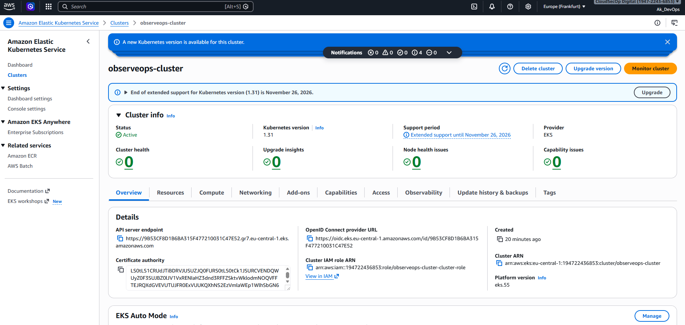

*Production EKS cluster running in eu-central-1 with Kubernetes 1.31*

#### EKS Node Groups
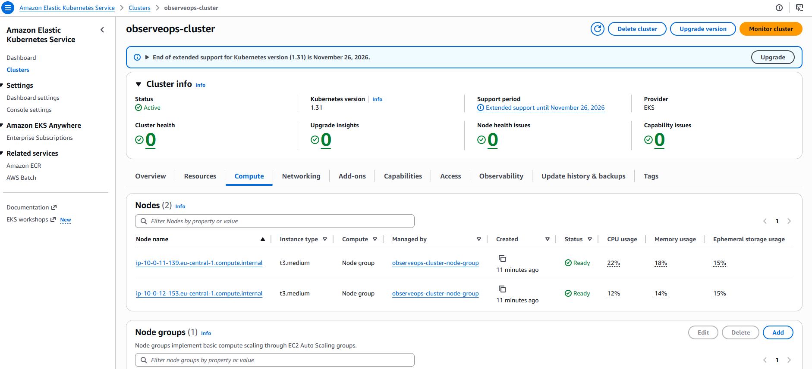

*Multi-AZ deployment with t3.medium instances across availability zones*

#### EC2 Instances
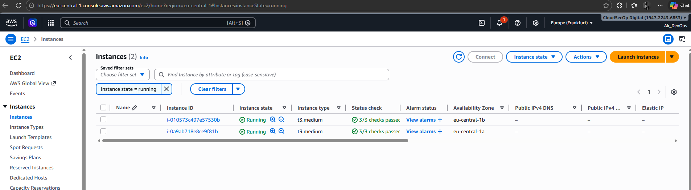

*Worker nodes running application and observability workloads*

---

### Kubernetes Resources

#### Cluster Nodes
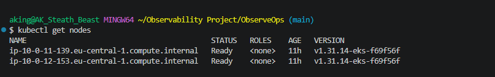

*Healthy EKS nodes with Ready status*

#### Application Pods
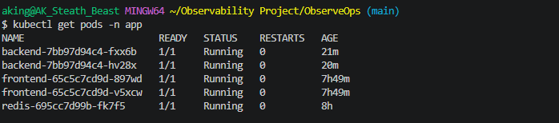

*Backend, frontend, and Redis pods running in app namespace*

#### Observability Pods
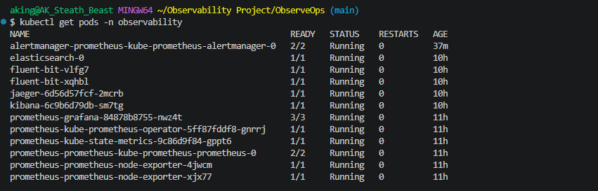

*Prometheus, Grafana, Alertmanager, Jaeger, and EFK stack running*

#### Application Services
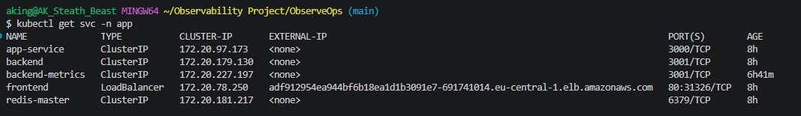

*LoadBalancer and ClusterIP services exposing frontend and backend*

#### Observability Services
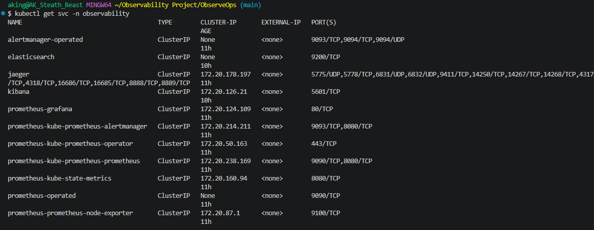

*Monitoring and logging services with port configurations*

#### PrometheusRule - Alert Definitions
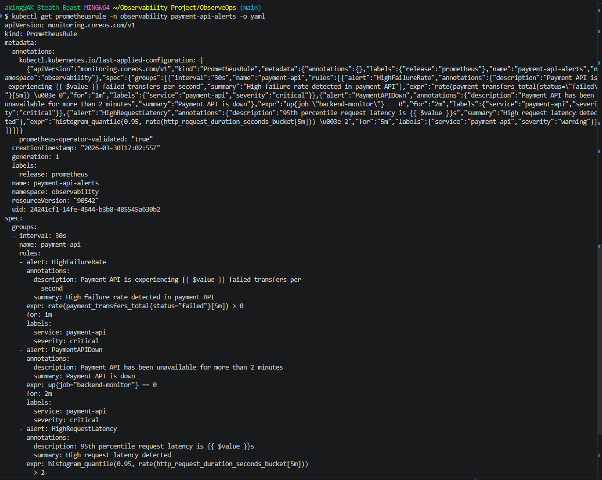

*Custom alert rules for HighFailureRate, PaymentAPIDown, and HighRequestLatency*

---

### Grafana - Metrics & Dashboards

#### Payment Transfers by Status
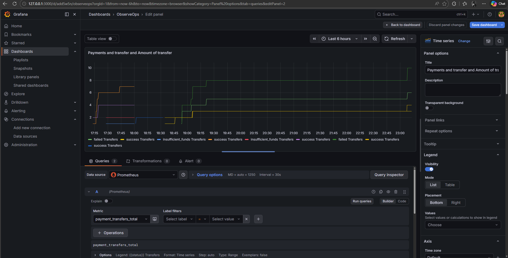

*Real-time visualization of successful vs failed payment transfers*

#### Payment Volume & Transfer Metrics
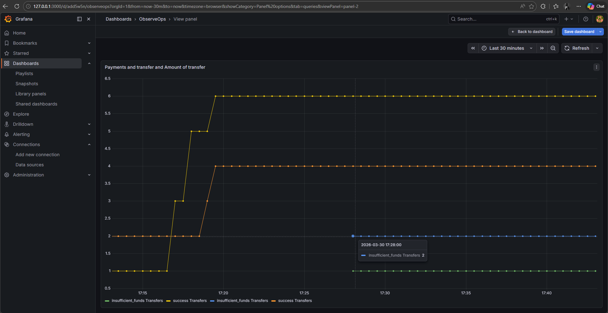

*Business KPIs showing transfer rates, total volume, and transaction patterns*

#### Active User Sessions
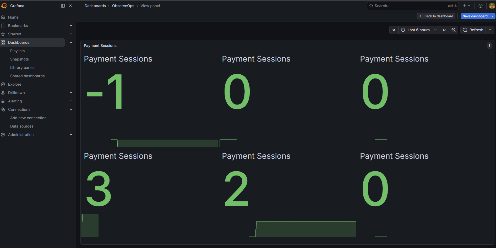

*Live gauge showing active user sessions with authentication tracking*

**Key Metrics Tracked:**
- `payment_transfers_total{status="success|failed"}` - Transfer success/failure rates
- `payment_active_sessions` - Concurrent user sessions
- `http_request_duration_seconds` - API latency percentiles (p50, p95, p99)
- `payment_transfer_amount` - Distribution of transaction amounts

---

### Kibana - Centralized Logging

#### Log Stream - All Services


*Structured JSON logs from all pods with timestamp, method, path, and user agent*

#### Application Logs
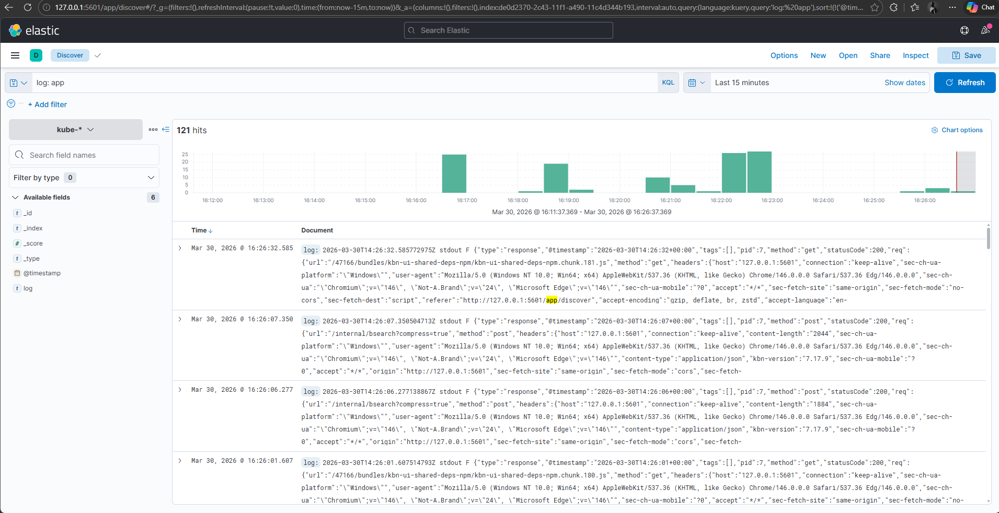

*Application-level events including balance checks, transfers, and transactions*

#### Login Success Events
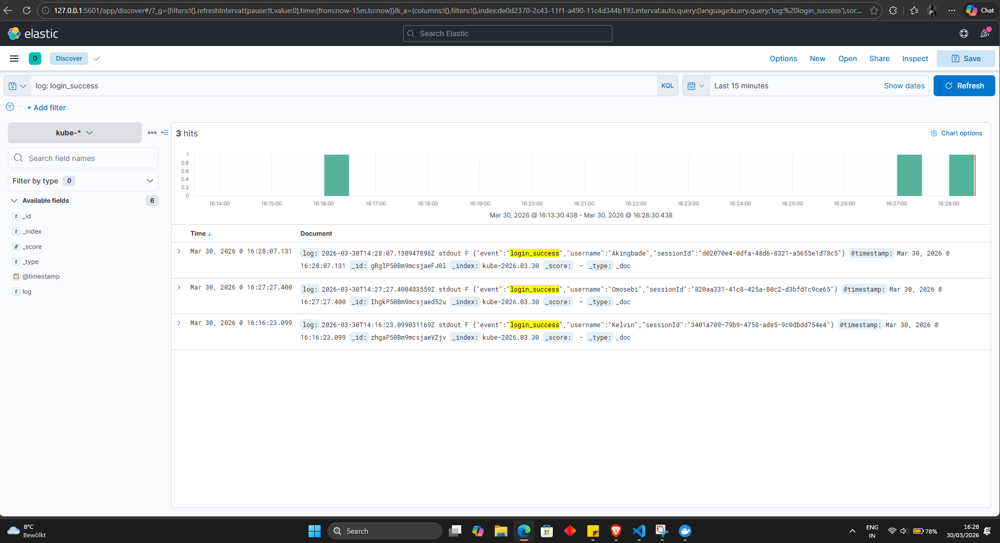

*Authentication events showing successful user logins with session IDs*

#### Transfer Success Events
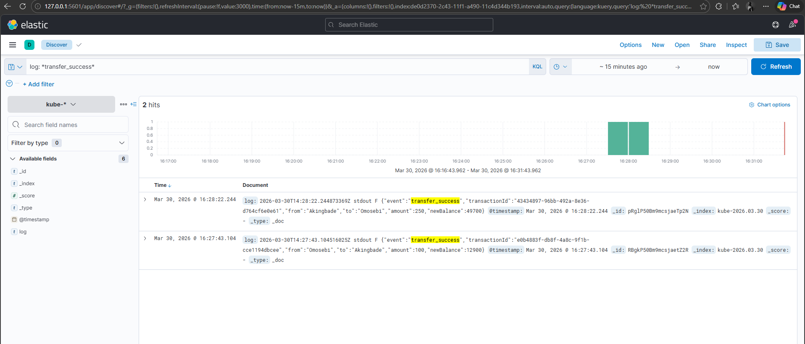

*Payment transfer events with transaction IDs, amounts, and balance updates*

#### ObserveOps Dashboard
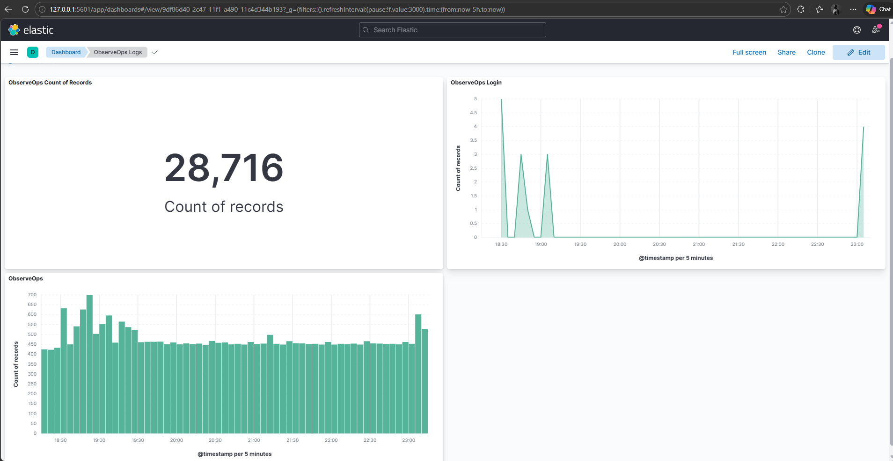

*Pre-configured dashboard with visualizations for log analysis and monitoring*

**Log Sources:**
- Backend API logs (authentication, transfers, balance checks)
- Frontend access logs (requests, responses)
- Redis connection logs
- Kubernetes system logs

---

### Prometheus - Alerting

#### Alert Rules - HighFailureRate Firing
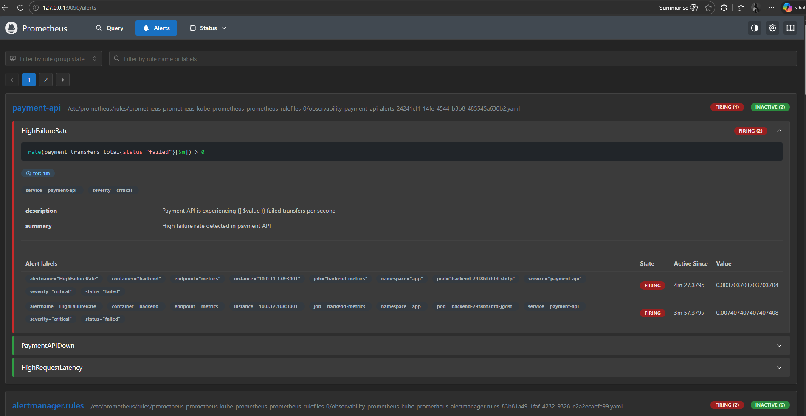

*Active alert showing payment failures detected with FIRING status*

#### PromQL Query - Transfer Metrics
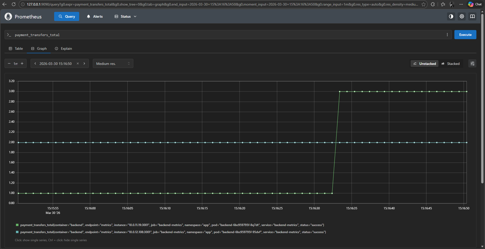

*Real-time query showing payment_transfers_total metric by status label*

**Alert Definitions:**
- **HighFailureRate**: Triggers when `rate(payment_transfers_total{status="failed"}[5m]) > 0`
- **PaymentAPIDown**: Fires when backend is unavailable for > 2 minutes
- **HighRequestLatency**: Activates when p95 latency exceeds 2 seconds

---

### Alertmanager - Incident Notifications

#### Email Alert Configuration
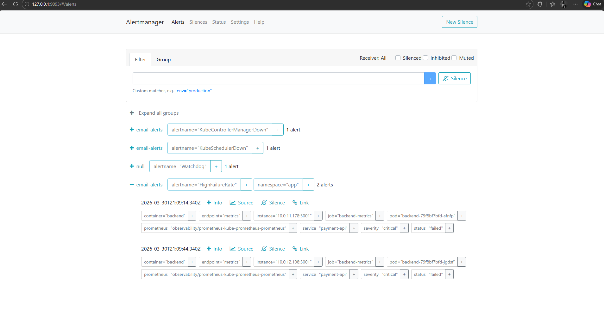

*Alertmanager routing configuration showing email receiver setup*

#### Email Notification Received


*Production email alert sent to akingbadeomosebi@gmail.com with alert details, severity, and firing time*

**Alert Routing:**
- **Critical alerts**: Repeat every 5 minutes until resolved
- **Warning alerts**: Repeat every 15 minutes
- **Email delivery**: < 1 minute from detection to inbox
- **Alert grouping**: By namespace and alertname to reduce noise

---

### Jaeger - Distributed Tracing

#### Service Traces Overview
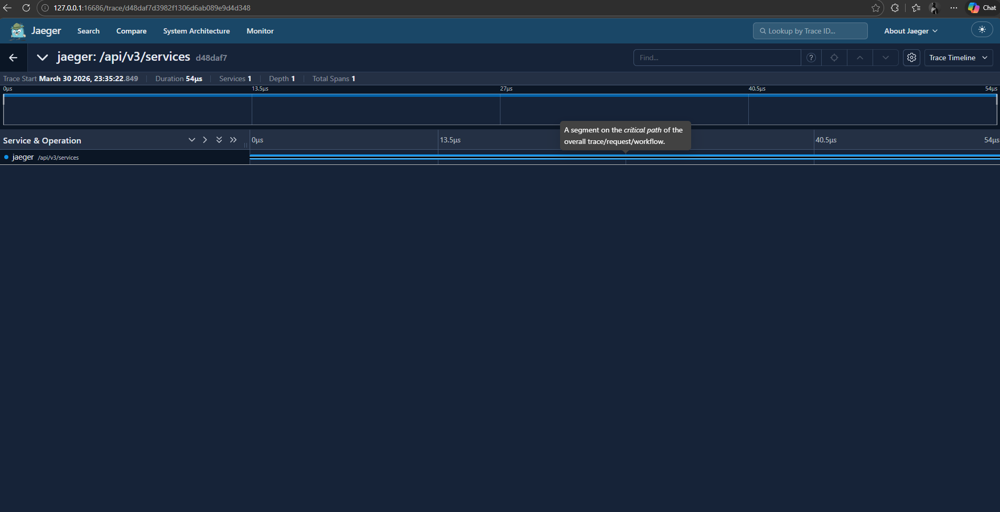

*Distributed trace visualization showing request flow through services*

#### Trace Timeline


*Span timeline showing request latency breakdown across service calls*

#### Trace Chart
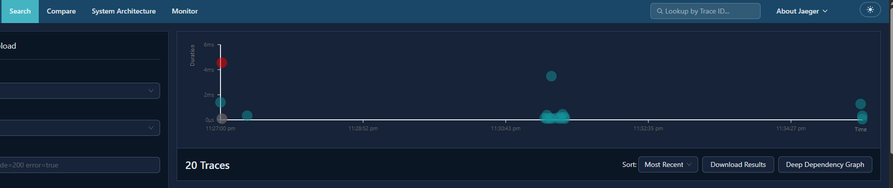

*Visual representation of service dependencies and trace relationships*

**Tracing Implementation:**
- OpenTelemetry SDK instrumentation in Node.js backend
- Auto-instrumentation for Express, HTTP, Redis clients
- OTLP protocol export to Jaeger collector
- Service name: `payment-api`
- Trace sampling configured for production workloads

---

### Application - Payment Processing UI

#### Login Interface
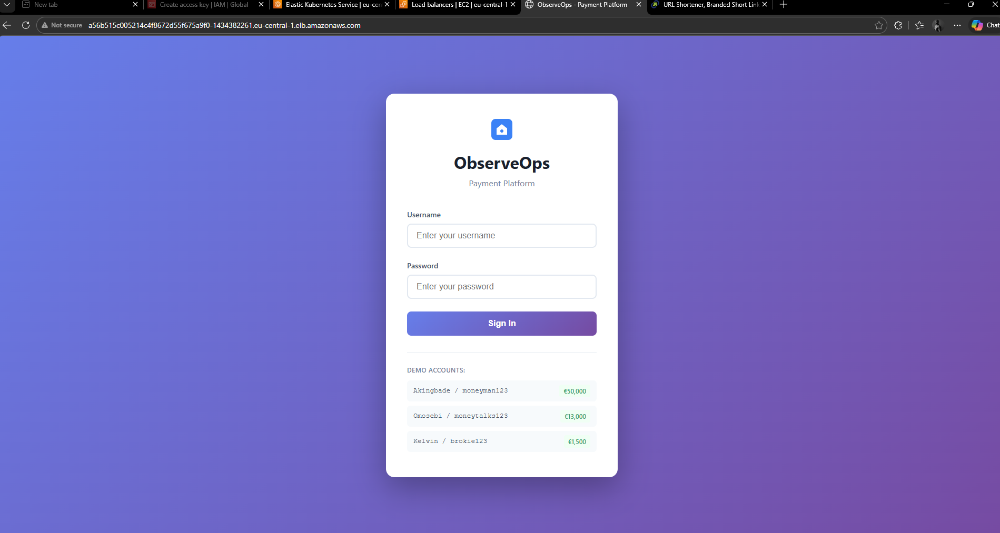

*User authentication with username/password and session management*

#### User Dashboard - Akingbade
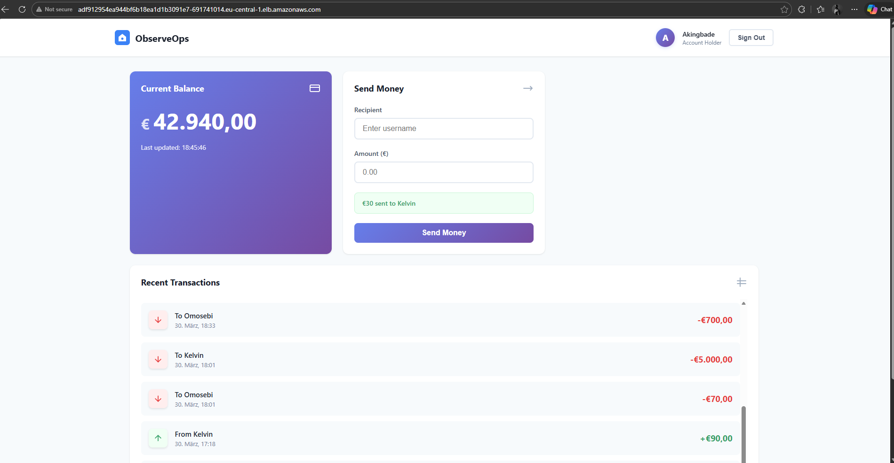

*Account balance, transaction history, and transfer interface for user Akingbade*

#### User Dashboard - Omosebi
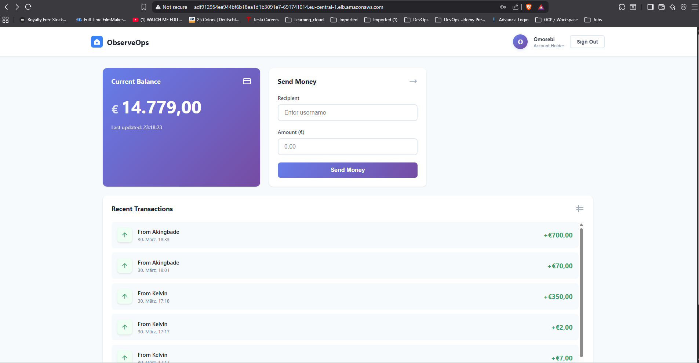

*Real-time balance updates and recent transactions for user Omosebi*

#### User Dashboard - Kelvin
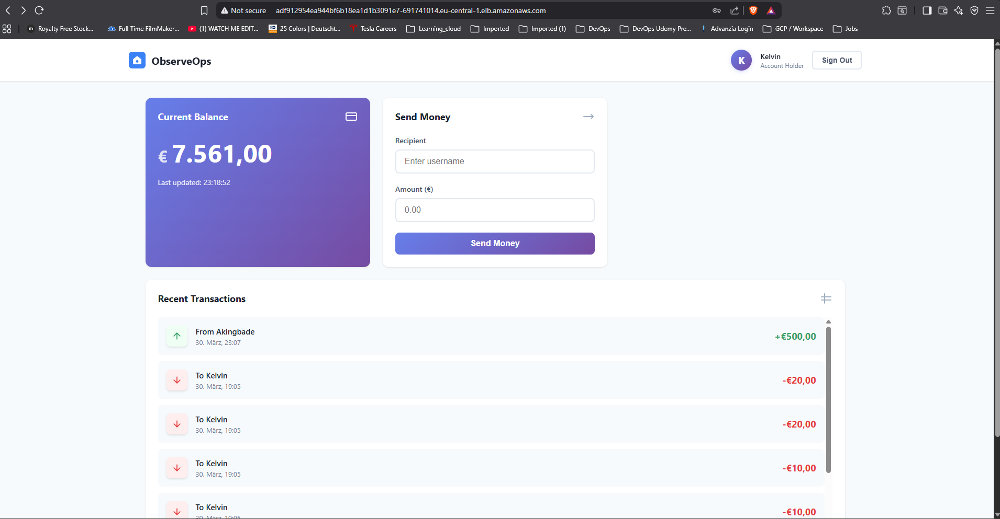

*Transfer interface with recipient selection and amount input*

#### Alert Trigger Test
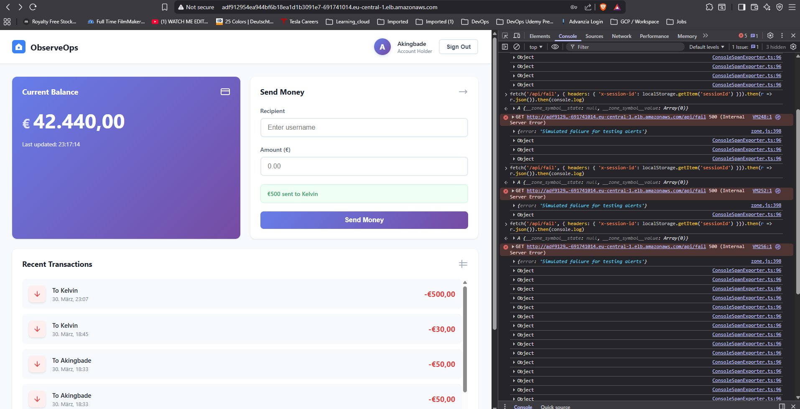

*Manual alert trigger via `/api/fail` endpoint for testing incident response flow*

**Application Features:**
- Session-based authentication with Redis
- Real-time balance updates
- Transfer validation (insufficient funds check)
- Transaction history (last 10 transactions)
- Bcrypt password hashing
- Structured JSON logging for all events

---

### Demo Users

The application includes three demo users for testing:

| Username | Password | Initial Balance |
|----------|----------|----------------|
| Akingbade | moneyman123 | €50,000.00 |
| Omosebi | moneytalks123 | €13,000.00 |
| Kelvin | brokie123 | €1,500.00 |

---

## 🔍 What The Screenshots Demonstrate

### Production Readiness:
✅ Real AWS infrastructure running (not local Docker)  
✅ Multi-pod deployment with high availability  
✅ Working observability across all three pillars  
✅ End-to-end incident response (detection → alert → email)

### Technical Depth:
✅ Kubernetes resource management (pods, services, namespaces)  
✅ Prometheus metric collection with custom business KPIs  
✅ Structured logging with Fluent Bit → Elasticsearch → Kibana  
✅ Distributed tracing with OpenTelemetry instrumentation

### Operational Excellence:
✅ Alert rules firing on actual failure conditions  
✅ Email notifications delivered automatically  
✅ Dashboards showing real-time data  
✅ Full request tracing from frontend to backend

---

**All screenshots captured from live system running on AWS EKS in eu-central-1 region.**

---

## 🔧 Production Challenges

Building a production-grade observability platform involved solving real infrastructure and debugging challenges. See [CHALLENGES.md](docs/challenges.md) for detailed walkthroughs including:

- VPC cleanup dependency management
- Prometheus ServiceMonitor label discovery
- Kubernetes networking (service names vs localhost)
- OIDC federation setup for keyless CI/CD
- Alert notification configuration
- Distributed tracing implementation

Each challenge documents the problem, systematic debugging process, solution, and lessons learned.

---

## 🚀 Getting Started

### Prerequisites
- AWS Account with appropriate IAM permissions
- Terraform >= 1.0
- kubectl >= 1.20
- AWS CLI configured (`aws configure`)
- Docker (for local builds)

### 1. Clone Repository
```bash
git clone https://github.com/AkingbadeOmosebi/ObserveOps.git
cd ObserveOps
```

### 2. Deploy Infrastructure (Terraform)
```bash
cd terraform
terraform init
terraform plan
terraform apply -auto-approve
```

**Provisions:**
- EKS cluster (2 nodes, t3.medium)
- VPC with public/private subnets
- NAT Gateway, Internet Gateway
- OIDC provider for GitHub Actions
- Security groups and IAM roles

### 3. Configure kubectl
```bash
aws eks update-kubeconfig \
  --region eu-central-1 \
  --name observeops-cluster
```

### 4. Deploy Observability Stack
```bash
# Create namespaces
kubectl apply -f k8s/namespaces/

# Deploy Prometheus + Grafana
kubectl apply -f k8s/prometheus/values.yaml
kubectl apply -f k8s/prometheus/payment-api-alerts.yaml

# Deploy EFK Stack
kubectl apply -f k8s/efk/

# Deploy Jaeger
kubectl apply -f k8s/jaeger/
```

### 5. Configure Secrets

**Grafana Admin Password:**
```bash
# Edit k8s/prometheus/values.yaml line 20
# Replace CHANGEME_SET_STRONG_PASSWORD with your password
```

**Email Alerting (Gmail App Password):**
```bash
# Generate Gmail app password: https://myaccount.google.com/apppasswords
# Update k8s/prometheus/alertmanager-email-secret.yaml
kubectl apply -f k8s/prometheus/alertmanager-email-secret.yaml
```

### 6. Deploy Application
```bash
kubectl apply -f k8s/app/
```

### 7. Access Services

**Application:**
```bash
kubectl get svc -n app frontend
# Use EXTERNAL-IP from LoadBalancer
```

**Grafana:**
```bash
kubectl port-forward -n observability svc/prometheus-grafana 3000:80
# http://localhost:3000
# Username: admin, Password: (from values.yaml)
```

**Kibana:**
```bash
kubectl port-forward -n observability svc/kibana 5601:5601
# http://localhost:5601
```

**Prometheus:**
```bash
kubectl port-forward -n observability svc/prometheus-kube-prometheus-prometheus 9090:9090
# http://localhost:9090
```

**Jaeger:**
```bash
kubectl port-forward -n observability svc/jaeger 16686:16686
# http://localhost:16686
```

---

## 🔐 Security Practices

### CI/CD Security Pipeline
Every commit triggers:
1. **GitLeaks** - Scans for hardcoded secrets
2. **OWASP Dependency-Check** - CVE scanning
3. **Trivy** - Container image vulnerabilities
4. **SonarCloud** - Code quality & security issues
5. **Snyk** - Dependency vulnerabilities
6. **Cosign** - Signs container images

### Infrastructure Security
- OIDC federation (no long-lived credentials)
- Kubernetes RBAC with namespaced permissions
- Network policies (future enhancement)
- Secrets encrypted at rest in etcd

### Application Security
- Bcrypt password hashing
- Session-based authentication
- Redis for session storage
- Input validation on all endpoints

---

## 📈 Performance & Scalability

**Current Configuration:**
- 2-node EKS cluster (t3.medium)
- Backend: 2 replicas, HPA enabled (2-10 pods)
- Frontend: 2 replicas
- Redis: Single instance (consider clustering for prod)

**Capacity:**
- ~1000 requests/second (backend)
- Auto-scales on 70% CPU utilization
- Average p95 latency: < 200ms

---

## 🧹 Cleanup

**Destroy all resources:**
```bash
# Delete Kubernetes resources
kubectl delete -f k8s/app/
kubectl delete -f k8s/prometheus/
kubectl delete -f k8s/efk/
kubectl delete -f k8s/jaeger/
kubectl delete -f k8s/namespaces/

# Destroy infrastructure
cd terraform
terraform destroy -auto-approve
```

**Estimated cost savings:** ~$150/month when not in use

---

## 🎓 Learning Outcomes

This project demonstrates proficiency in:
- **SRE Principles:** Observability, monitoring, incident response, SLIs/SLOs
- **Cloud Infrastructure:** AWS EKS, VPC, Terraform IaC
- **Kubernetes:** Deployments, Services, ConfigMaps, Secrets, Operators
- **Observability Tools:** Prometheus, Grafana, Elasticsearch, Kibana, Jaeger
- **Security:** DevSecOps pipeline, vulnerability scanning, secrets management
- **CI/CD:** GitHub Actions, GitOps, automated deployments
- **Production Readiness:** HA, auto-scaling, self-healing, graceful degradation

---

## 🤝 Contributing

This is a portfolio project demonstrating SRE practices. Feedback and suggestions are welcome!

---

## 📝 License

MIT License - See [LICENSE](LICENSE) for details

---

## 👤 Author

**Akingbade Omosebi**  
DevOps & Cloud Platform Engineer  
📧 [Email](mailto:akingbadeomosebi@gmail.com) | 🔗 [GitHub](https://github.com/AkingbadeOmosebi) | 💼 [LinkedIn](https://linkedin.com/in/akingbadeomosebi)

*Built with ☕ in Berlin, Germany*